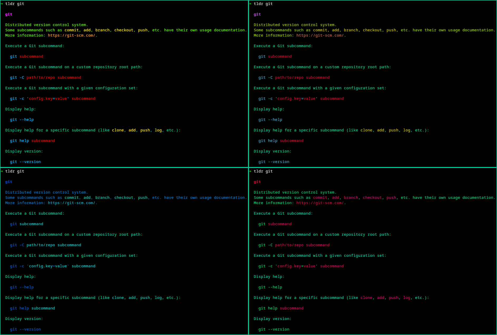

# Cybertopia theme for tlrc

> Dark theme (and several variants) for [tlrc](https://github.com/tldr-pages/tlrc)



## Installation

### Install using Git

If you are a git user, you can install the theme and keep up to date by cloning the repo:

```bash
git clone https://github.com/noraj/cybertopia-tlrc.git
```

### Install manually

Download using the [GitHub `.zip` download](https://github.com/noraj/cybertopia-tlrc/archive/master.zip) option and unzip them.

### Activating theme

1. Select one of the 4 variants of tlrc configuration file:
  - `config.<theme_variant>.full.toml`: **Full** default tlrc configuration file with Cybertopia theme and **default** background (includes complete configuration)
  - `config.<theme_variant>.min.toml`: **Minimal** default tlrc configuration file with Cybertopia theme and **default** background (includes only theme configuration)
  - `config.<theme_variant>.with_bg.full.toml`: **Full** default tlrc configuration file with Cybertopia theme and **Cybertopia** background (includes complete configuration)
  - `config.<theme_variant>.with_bg.min.toml`: **Minimal** default tlrc configuration file with Cybertopia theme and **Cybertopia** background (includes only theme configuration)
2. Copy the configuration file to `~/.config/tlrc/config.toml`.
3. Boom! It's working ✨

If you want to enable the prefix bullet for examples using a computer emoji, modify the following lines:

```toml
[output]
show_hyphens = true
example_prefix = "💻 "
```
